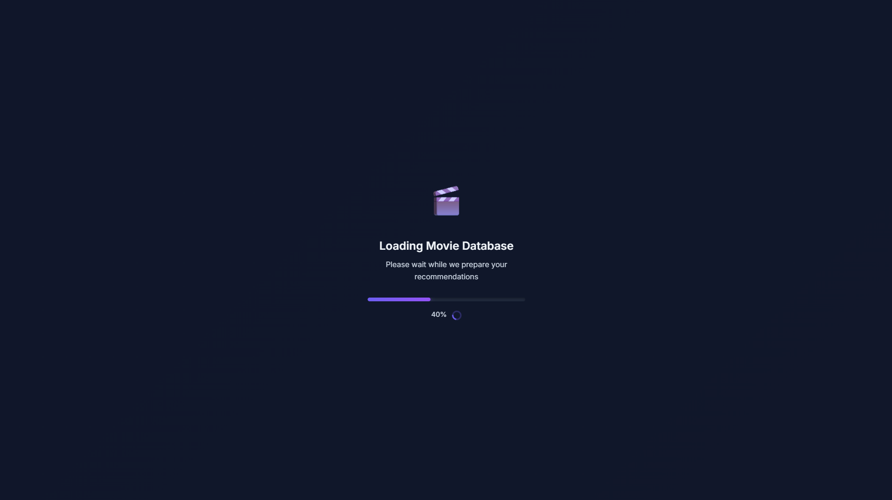
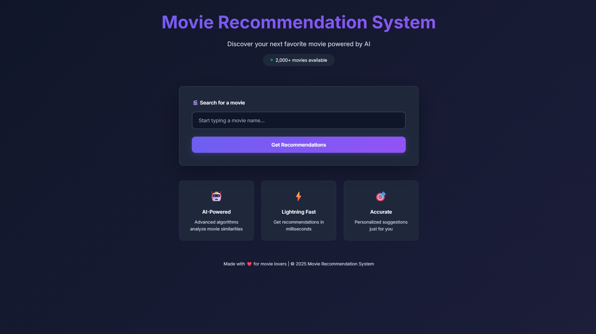
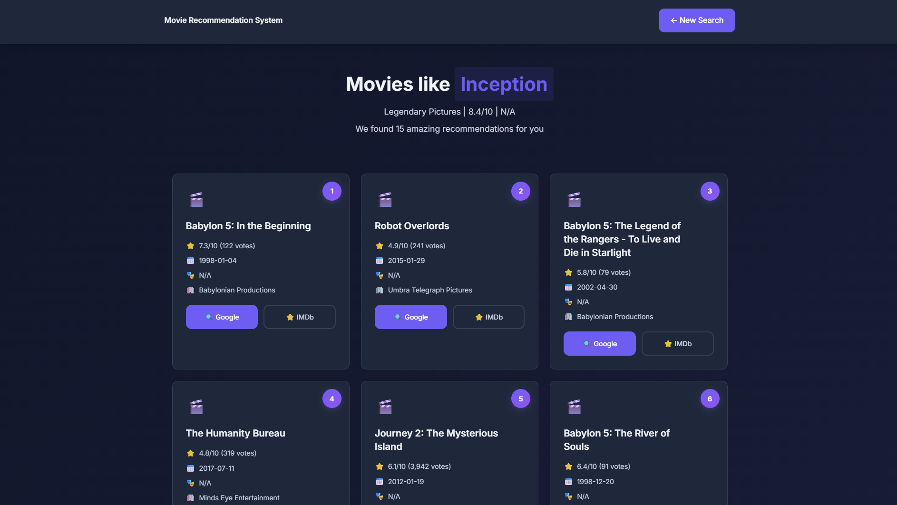

# 🎬 Movie Recommendation System

> A movie recommendation web application that suggests movies based on the similarity between movies. I built this project using Django, Python, and Machine Learning with a content-based recommendation approach.

---

## 🎯 Overview

The Movie Recommendation System provides intelligent movie suggestions using **content-based filtering** with TF-IDF and SVD dimensionality reduction. It features a modern web interface, RESTful API, and supports datasets from 2K to 1M+ movies.


## 📌 About the Project

The system allows users to search for a movie and get a list of similar movies based on their content such as genres, overview, keywords, and other movie information.

The recommendation model uses TF-IDF to convert movie information into numerical features and SVD to reduce the dimensionality of the data and make recommendations more efficient.

---

## User Features
* 🔍 Search for movies with autocomplete suggestions
* 🎬 Get recommendations for similar movies
* ⭐ Display movie ratings and other details
* 🎭 Show movie genres and related information
* 🔗 Quick links to Google and IMDb
* 📱 Responsive and user-friendly interface
* ⚡ Fast movie recommendations
* 📊 Machine Learning-based recommendation system

## 🧠 How It Works

1. The user searches for a movie.
2. The system finds the selected movie in the dataset.
3. Movie information is converted into numerical features using **TF-IDF**.
4. **SVD** is used to reduce the feature dimensions.
5. The system compares the selected movie with other movies.
6. The most similar movies are displayed as recommendations.

## 🛠️ Technologies Used

* **Python**
* **Django**
* **HTML / CSS**
* **JavaScript**
* **Pandas**
* **NumPy**
* **Scikit-learn**
* **SciPy**

---

## 📸 Screenshots & Demo

### Model Loading



### Home Page



### Movie Search Recommendations



---

## 📁 Project Structure

```
movie-recommendation-system/
│
├── 📚 Documentation
│   ├── README.md                  # This file - overview and quick start
│   ├── PROJECT_GUIDE.md           # Complete technical guide
│   └── CHANGELOG.md               # Version history and changes
│
├── ⚙️ Django Application
│   ├── movie_recommendation/      # Django project settings
│   │   ├── settings.py           # Configuration
│   │   ├── urls.py               # URL routing
│   │   └── wsgi.py               # WSGI entry point
│   │
│   ├── recommender/              # Main application
│   │   ├── views.py              # Recommendation logic
│   │   ├── urls.py               # App URLs
│   │   └── templates/            # HTML templates
│   │       └── recommender/
│   │           ├── index.html    # Search page
│   │           ├── result.html   # Results page
│   │           └── error.html    # Error page
│   │
│   ├── manage.py                 # Django management script
│   └── requirements.txt          # Python dependencies
│
├── 🎓 Model Training
│   └── training/
│       ├── train.py              # Training pipeline
│       ├── infer.py              # Inference examples
│       └── guide.md              # Training documentation
│
├── 🎯 Models (Created after training)
│   └── models/
│       ├── movie_metadata.parquet    # Movie information
│       ├── similarity_matrix.npz     # Similarity scores
│       ├── title_to_idx.json         # Title mappings
│       ├── tfidf_vectorizer.pkl      # TF-IDF model
│       └── svd_model.pkl             # SVD reduction model
│
├── 📦 Static Files
│   └── static/
│       ├── logo.png                  # Application logo
│       ├── demo_model.parquet        # Demo similarity model (2K)
│       └── top_2k_movie_data.parquet # Demo movie data (2K)
│
└── 🚀 Deployment
    ├── Procfile                  # Heroku configuration
    ├── render.yaml               # Render configuration
    └── .gitignore                # Git ignore rules
```

---

🚀 Future Improvements
* Add user-based recommendations using ratings and watch history
* Improve recommendations using collaborative filtering
* Add movie posters and trailers
* Add user accounts and personalized recommendations
* Improve the recommendation model with additional movie features
  
<div align="center">

Built as a Machine Learning + Web Development project to explore recommendation systems and Django.

</div>
